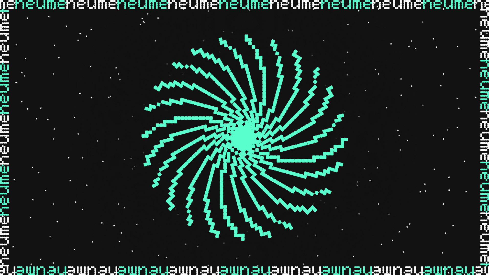

# Neume Crawler

> Crawl all music NFTs; supersedes
> [neume-network/core](https://github.com/neume-network/core). (Work in
> Progress)

The vision of neume is to index all web3 music activity and make it public. You can [run your own instance]() of neume to index all data or you can use someone else's instance to just [consume the indexed data]() using JSON-RPC calls.

<p style="text-align: center;">
  
</p>

**Table of Contents**
- [Neume Crawler](#neume-crawler)
  - [How to consume the indexed data?](#how-to-consume-the-indexed-data)
    - [Mental Model](#mental-model)
    - [`getIdsChanged_fill(from, to)`](#getidschanged_fillfrom-to)
      - [Example](#example)
    - [Pseudocode](#pseudocode)
  - [Run your own instance of Neume](#run-your-own-instance-of-neume)
    - [Commands](#commands)
      - [crawl](#crawl)
      - [filter-contracts](#filter-contracts)
      - [daemon](#daemon)
      - [init](#init)
    - [Requirements](#requirements)
    - [Setup](#setup)
      - [Create a new npm project](#create-a-new-npm-project)
      - [Install crawler as a dependency.](#install-crawler-as-a-dependency)
      - [Initialize the project](#initialize-the-project)
    - [Dissecting the `init` command](#dissecting-the-init-command)
      - [`config.js`](#configjs)
      - [`data` directory](#data-directory)
    - [Running your first crawl](#running-your-first-crawl)
    - [Developement](#developement)
  - [Architecture Overview](#architecture-overview)
    - [Pseudocode for crawl command](#pseudocode-for-crawl-command)


## How to consume the indexed data?

The neume daemon exposes JSON-RPC methods to consume data.

### Mental Model

neume saves each NFT (type [NFT]()) which includes information such as its tokenURI, metadata, current owner and tracks changes to it. Using `getIdsChanged_fill` function we can ask neume for what's new.

### `getIdsChanged_fill(from, to)`

`getIdsChanged_fill` is a method that returns inserts/updates to the database in the given block range.

#### Example

Let's suppose a new NFT was minted at block number 16572314.

```js
getIdsChanged_fill(16572314, 16572314)[
  /* Result */
  {
    id: {
      chainId: "1",
      address: "0xa6c4df945dbb1d71fe9a8d71ae93b8d5c2bbebe4",
      tokenId: "6975",
      blockNumber: 16572314,
    },
    value: {
      version: "2.0.0",
      title: "XYZ",
      artist: {
        version: "2.0.0",
        name: "Snoop Dogg",
        address: "0xE0036fb4B5A3B232aCfC01fEc3bD1D787a93da75",
      },
      platform: {
        version: "2.0.0",
        name: "Sound Protocol",
        uri: "https://sound.xyz",
      },
      erc721: {
        version: "2.0.0",
        createdAt: 16563504,
        transaction: {
          from: "0x59975dFE25845bF9C0eFf1102Ac650599c3f491a",
          to: "0x7Dd7fd8ACd39e557A6c570965eeA2b4008c4Dd1c",
          blockNumber: 16572314,
          transactionHash: "0xa80214bad12482943020cd539c099b45c2acc86373bd28d0173303d6042049c0",
        },
        address: "0xa6c4df945dbb1d71fe9a8d71ae93b8d5c2bbebe4",
        tokenId: "6975",
        tokenURI: "ar://T5aZ_6FYBIRnvMX7O6qbE4ZSEnysMlZbHhlnFmUvAMk/0",
        metadata: {
          animation_url: "ar://_VUsZCeJQWVD4hFcgb5w39GqekARiN8ff-ptw63lH28",
          artist: "Snoop Dogg",
          artwork: {
            mimeType: "image/png",
            uri: "ar://gB04RsiCpgEbwxKs-tRh5gsycsUo-tGDdWQIkM51f6U",
            nft: null,
          },
          attributes: [
            {
              trait_type: "XYZ",
              value: "Song Edition",
            },
          ],
          bpm: null,
          credits: null,
          description:
            "Music OEs. Buy as many as U want\n\n.00420Ξ (8$)\u0003--> Open 72 Hours \n\nGonna give 1 of my vintage cars from tha compound 2 tha golden egg winner... Only If we hit 42,000 mints\n\nClaimable only in Inglewood California",
          duration: 129,
          external_url: "https://www.sound.xyz/snoopdogg/xyz",
          genre: "Hip-hop & Rap",
          image: "ar://gB04RsiCpgEbwxKs-tRh5gsycsUo-tGDdWQIkM51f6U",
          isrc: null,
          key: null,
          license: null,
          locationCreated: null,
          losslessAudio: "ar://_VUsZCeJQWVD4hFcgb5w39GqekARiN8ff-ptw63lH28",
          lyrics: null,
          mimeType: "audio/mpeg",
          nftSerialNumber: null,
          name: "XYZ",
          originalReleaseDate: null,
          project: null,
          publisher: null,
          recordLabel: null,
          tags: null,
          title: "XYZ",
          trackNumber: 1,
          version: "sound-edition-20220930",
          visualizer: null,
        },
      },
      manifestations: [
        {
          version: "2.0.0",
          uri: "ar://_VUsZCeJQWVD4hFcgb5w39GqekARiN8ff-ptw63lH28",
          mimetype: "audio",
        },
        {
          version: "2.0.0",
          uri: "ar://gB04RsiCpgEbwxKs-tRh5gsycsUo-tGDdWQIkM51f6U",
          mimetype: "image",
        },
      ],
    },
  }
];
```

If the NFT was transfered at block number 16572315 from `0x7Dd7fd8ACd39e557A6c570965eeA2b4008c4Dd1c` to `0x076D520333b2163C51897FAC8939a3606e5b4a95` we will get the following result.

```js
getIdsChanged_fill(16572314, 16572314)[
  /* Result */
  {
    id: {
      chainId: "1",
      address: "0xa6c4df945dbb1d71fe9a8d71ae93b8d5c2bbebe4",
      tokenId: "6975",
      blockNumber: 16572314,
    },
    value: {
      version: "2.0.0",
      title: "XYZ",
      artist: {
        version: "2.0.0",
        name: "Snoop Dogg",
        address: "0xE0036fb4B5A3B232aCfC01fEc3bD1D787a93da75",
      },
      platform: {
        version: "2.0.0",
        name: "Sound Protocol",
        uri: "https://sound.xyz",
      },
      erc721: {
        version: "2.0.0",
        createdAt: 16563504,
        /* Note: only the transaction object has changed */
        transaction: {
          from: "0x7Dd7fd8ACd39e557A6c570965eeA2b4008c4Dd1c",
          to: "0x076D520333b2163C51897FAC8939a3606e5b4a95",
          blockNumber: 16572314,
          transactionHash: "0xA3B232aCfC01fE943020cd539c099b45c2acc86373bd28d0173303d6042049c0",
        },
        address: "0xa6c4df945dbb1d71fe9a8d71ae93b8d5c2bbebe4",
        tokenId: "6975",
        tokenURI: "ar://T5aZ_6FYBIRnvMX7O6qbE4ZSEnysMlZbHhlnFmUvAMk/0",
        metadata: {
          animation_url: "ar://_VUsZCeJQWVD4hFcgb5w39GqekARiN8ff-ptw63lH28",
          artist: "Snoop Dogg",
          artwork: {
            mimeType: "image/png",
            uri: "ar://gB04RsiCpgEbwxKs-tRh5gsycsUo-tGDdWQIkM51f6U",
            nft: null,
          },
          attributes: [
            {
              trait_type: "XYZ",
              value: "Song Edition",
            },
          ],
          bpm: null,
          credits: null,
          description:
            "Music OEs. Buy as many as U want\n\n.00420Ξ (8$)\u0003--> Open 72 Hours \n\nGonna give 1 of my vintage cars from tha compound 2 tha golden egg winner... Only If we hit 42,000 mints\n\nClaimable only in Inglewood California",
          duration: 129,
          external_url: "https://www.sound.xyz/snoopdogg/xyz",
          genre: "Hip-hop & Rap",
          image: "ar://gB04RsiCpgEbwxKs-tRh5gsycsUo-tGDdWQIkM51f6U",
          isrc: null,
          key: null,
          license: null,
          locationCreated: null,
          losslessAudio: "ar://_VUsZCeJQWVD4hFcgb5w39GqekARiN8ff-ptw63lH28",
          lyrics: null,
          mimeType: "audio/mpeg",
          nftSerialNumber: null,
          name: "XYZ",
          originalReleaseDate: null,
          project: null,
          publisher: null,
          recordLabel: null,
          tags: null,
          title: "XYZ",
          trackNumber: 1,
          version: "sound-edition-20220930",
          visualizer: null,
        },
      },
      manifestations: [
        {
          version: "2.0.0",
          uri: "ar://_VUsZCeJQWVD4hFcgb5w39GqekARiN8ff-ptw63lH28",
          mimetype: "audio",
        },
        {
          version: "2.0.0",
          uri: "ar://gB04RsiCpgEbwxKs-tRh5gsycsUo-tGDdWQIkM51f6U",
          mimetype: "image",
        },
      ],
    },
  }
];
```

**Note:** only the transaction object has changed.

### Pseudocode

```js
async function consume(from, to) {
  let {
    data: { result },
  } = await axios.post("https://sync1.neume.network/", {
    jsonrpc: "2.0",
    method: "getIdsChanged_fill",
    id: "1",
    params: [from, to],
  });

  for (r of result) {
    const id = r.id;
    const nft = r.value;

    if (db.exists(id)) {
      await db.update(id, value);
    } else {
      await db.create(id, value);
    }
  }
}

for (let i = 0; i < latestBlockNumber; i += 5000) {
  await consome(i, i + 5000);
}
```

- The `db` depends on the database for your application.
- `https://sync1.neume.network/` is an endpoint where the neume daemon is running.

JSON-RPC reference can be found at [...].

## Run your own instance of Neume

The neume tool is exposed as a CLI with the following commands.

### Commands

General help can be found using `npx neume --help` or command specific help can be found using `npx neume <command> --help`.

#### crawl

The crawl command crawls the blockchain for data.

#### filter-contracts

The filter-contracts command finds contracts that will be crawled by the crawl command.

A few platforms use the factory pattern to deploy a new contract for each artist. Therefore, we need to find such contracts and later crawl them for data.

#### daemon

The daemon command starts the JSON RPC server, and periodically runs the crawl and filter-contracts command. The JSON RPC server is used to consume the data.

Most people will only need this one command.

#### init

The init command creates the required files and folders required to start the neume instance for the first time.

### Requirements

- Unix-like operating system
- Access to an archive node
- Access to an IPFS gateway
- Access to an Arweave gateway

### Setup

#### Create a new npm project

`npm init -y`

#### Install crawler as a dependency.

`npm install github:neume-network/crawler`

#### Initialize the project

`npx neume init`

The `init` command will create files and folders at the current working directory. The files and folders are required by neume for its configuration and data storage.

### Dissecting the `init` command

#### `config.js`

neume stores the configuration common for all commands in a file `config.js`. This file is read from the current working directory.

It contains configuration such as RPC hosts, IPFS gateway, and concurrency. A sample file can be found at [`assets/config.sample.js`](./assets/config.sample.js)

The init command will create the `config.js` file with sample values. Please populate it according to your needs. The comments inside the file should guide you.

#### `data` directory

The data directory is the database for neume. It should also be present in the current working directory.

### Running your first crawl

Once the project is initialized you can use the daemon command to start crawling.

`npx neume daemon --port 8080`

Check the man page for the daemon command to see what else can be done with it.

### Developement

Developers of neume can clone the repo and run the `init` command inside the
repo and start crawling.

```
node --loader ts-node/esm neume.ts init
```

In fact, all commands can be run using `ts-node`.

```
node --loader ts-node/esm neume.ts daemon
```

## Architecture Overview

Neume heavily depends on a RPC node and avoids centralized servers.

### Pseudocode for crawl command

```c
from = process.argv[2]
to = process.argv[4]

contracts = import('./data/contracts.json')

for contract in contracts:
  // use eth_getLog to find all transfer events
  // in the given block range
  logs = getLogs(Transfer, from ,to)
  for log in logs:
    nft = {}
    // extract tokenId from log
    nft.tokenId = decodeLog(log)
    // use eth_call to get
    nft.tokenUri = callTokenUri(tokenId)
    // get the data behind the tokenURI
    nft.tokenUriContent = getTokenUri(tokenUri)
    // transform all the collected data according
    // to neume schema
    nft = transform(nft)

    saveToDB(nft)
```
